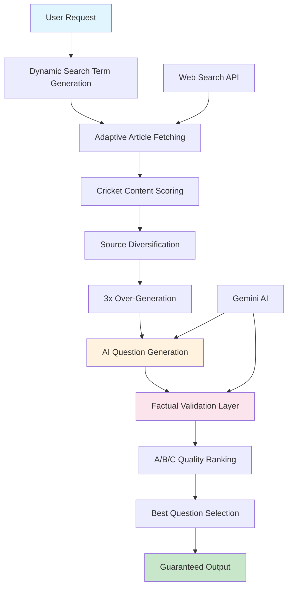

# 🏏 CAT - Cricket AI Trivia

<div align="center">
  
</div>

An intelligent, AI-powered cricket trivia engine that generates engaging, factual questions through advanced web search integration and multi-layer validation. Built with React Native for cross-platform mobile experience and featuring a sophisticated CLI testing framework with multi-model AI support (Gemini and OpenRouter).

## About

Cricket AI Trivia (CAT) was created by **Sidd Nambiar** out of a passion for cricket and fascination with AI/Data Science projects. This system goes beyond simple question generation by implementing an intelligent pipeline that ensures both quality and quantity through adaptive content discovery and factual validation.

CAT solves the fundamental challenge of creating engaging, accurate cricket trivia at scale. Traditional trivia systems rely on static databases that become stale and repetitive. CAT dynamically discovers cricket content from the web, extracts factual information, and generates contextually rich questions that test genuine cricket knowledge rather than article comprehension.

## What Makes CAT Special

### Intelligent Content Discovery
CAT doesn't just generate random cricket questions. It actively searches for cricket content using 25+ dynamic search patterns, scores articles for cricket relevance, and ensures source diversity to prevent content clustering.

### Factual Validation Framework
The system distinguishes between factual cricket events and subjective opinions. Questions test knowledge of actual cricket history—scores, dates, performances, results—rather than what an article "considers" important.

### Guaranteed Quality & Quantity
Through a sophisticated 3x over-generation strategy with A/B/C quality ranking, CAT guarantees the requested number of high-quality questions by generating more than needed and selecting the best.

## Architecture Overview



### AI Processing Pipeline

1. **Search Intelligence**: Generates varied search terms with dramatic modifiers ("legendary moments", "controversial decisions")
2. **Content Discovery**: Adaptively fetches 15-50 articles based on quality and relevance
3. **Fact Extraction**: Identifies concrete cricket events vs. subjective commentary
4. **Multi-Generation**: Creates 3x more questions than needed for better selection
5. **Validation Engine**: AI fact-checker validates against source articles
6. **Quality Ranking**: A/B/C grading system ensures only top-tier questions
7. **Smart Selection**: Automatically selects best questions to guarantee count

## Key Features

### 🧠 Intelligent Question Generation
- **Adaptive Fetching**: Automatically scales from 15 to 50 articles based on content quality
- **Factual Framework**: Questions test cricket knowledge, not article opinions
- **Dynamic AI Configuration**: Temperature/topP varies by difficulty and category
- **Quality Assurance**: Multi-layer validation with A/B/C ranking system

### 🔍 Advanced Content Discovery
- **25+ Search Variations**: Dynamic terms with dramatic modifiers for engaging content
- **Cricket Content Scoring**: Filters articles based on cricket relevance and story potential
- **Source Diversification**: Prevents clustering from same sources
- **Fallback Strategies**: Multiple search approaches ensure content discovery

### 📊 Quality Control System
- **Factual Validation**: Distinguishes between facts and opinions
- **Event-Centric Questions**: Focus on "what happened" vs "what article says"
- **Cricket Context Verification**: Ensures proper terminology and authenticity
- **Performance Monitoring**: 3-4 second generation targets with success tracking

### 🎮 Game Modes
- **Learn Cricket**: Interactive 2-over quiz format with adaptive AI
  - 6 questions per over, cricket-style scoring
  - Time-based scoring (6 runs for fast answers, dot ball for slow)
  - Adaptive difficulty based on performance
  - Fast mode with multiple AI model options
- **Trivia Generation**: Web-powered question creation from current cricket content
- **Tutorial Mode**: Guided introduction to cricket basics

### 🎯 Trivia Categories
- **Legendary Moments**: Game-changing performances and historic matches
- **Player Stories**: Career highlights and compelling personal narratives  
- **Records & Stats**: Record-breaking achievements with dramatic context
- **Rules & Formats**: Game evolution and format innovations
- **Cultural Impact**: Cricket's influence beyond the sport

## Architecture Highlights

### Dual-Platform Design
- **React Native Mobile App**: Cross-platform trivia game with TypeScript
- **CLI Testing Framework**: Advanced pipeline testing with 7 specialized commands
- **Shared Services**: Common AI and validation logic across platforms

### AI Service Architecture
- **GeminiService**: Core AI integration with dynamic configuration
- **Validation Engine**: Multi-layer fact-checking and quality assessment
- **Search Integration**: Google Custom Search with cricket-focused filtering
- **Performance Optimization**: Intelligent caching and adaptive processing

### Quality Assurance Pipeline
- **Input Validation**: Filter and parameter verification
- **Content Scoring**: Cricket relevance and engagement metrics
- **Generation Validation**: Factual accuracy and cricket context checking
- **Output Ranking**: A/B/C quality grades for systematic selection

## User Interface

### Mobile App (React Native)
- **TriviaGame Component**: Main game interface with question display
- **Practice Mode**: Unlimited questions for continuous learning
- **Game Mode**: Fixed rounds with scoring and progress tracking
- **Responsive Design**: Optimized for various screen sizes
- **Live Generation**: Real-time question creation during gameplay

### CLI Testing Interface
Comprehensive testing framework with specialized commands:
- `learn-cricket`: Interactive cricket learning quiz with adaptive AI
- `learn-cricket-fast`: Speed-optimized version with model selection
- `search-generate`: Advanced two-phase pipeline for trivia generation
- `verify`: Web verification of cricket facts using Google Search
- `performance`: Benchmarking and optimization testing
- `search`: Google Custom Search API testing
- `speed-test`: Performance comparison of different configurations

### Developer Experience
- **Comprehensive Documentation**: Complete architecture guide and CLI reference
- **Real-time Feedback**: Detailed logging and progress indicators
- **Performance Metrics**: Generation timing and success rate monitoring
- **Quality Insights**: A/B/C ranking distribution and validation results

## Quick Start

### Prerequisites
- Node.js and npm
- Expo CLI (for mobile development)
- Google Gemini API key
- Google Custom Search API key (for CLI features)
- OpenRouter API key (optional, for V2 pipeline)

### Installation
```bash
# Clone repository
git clone https://github.com/sidscorp/cricket-ai-trivia.git
cd cricket-ai-trivia

# Install dependencies
npm install

# Configure environment
cp .env.example .env
# Add your API keys to .env

# Start mobile app
npm start

# Test CLI commands
npm run cli:learn          # Interactive cricket quiz
npm run cli:questions      # Generate trivia questions
npm run cli:search -- -q "cricket topic"  # Search test
```

### API Configuration
Create `.env` file with:
```
EXPO_PUBLIC_GEMINI_API_KEY=your_gemini_key
GOOGLE_CUSTOM_SEARCH_API_KEY=your_search_key
GOOGLE_CUSTOM_SEARCH_CX=your_search_engine_id
EXPO_PUBLIC_OPENROUTER_API_KEY=your_openrouter_key
```

## Available Commands

### Mobile App
```bash
npm start          # Start Expo development server
npm run android    # Run on Android device/emulator
npm run ios        # Run on iOS simulator
npm run web        # Run in web browser
```

### CLI Commands
```bash
# Interactive Learning Mode
npm run cli:learn       # Play adaptive cricket quiz (2 overs, 6 questions each)
npm run cli:learn-fast  # Speed-optimized quiz with model selection

# Question Generation
npm run cli:questions   # Generate trivia from web search (V2 pipeline)
npm run cli:verify      # Verify cricket facts with web search

# Testing & Performance
npm run cli:perf        # Run performance benchmarks
npm run cli:speed       # Compare speed optimizations
npm run cli:search -- -q "search term"  # Test Google search

# Help
npm run cli:help        # Show all available commands
```

### Command Examples
```bash
# Generate 10 trivia questions about legendary moments
npm run cli:questions -- -c legendary_moments -n 10

# Verify a cricket fact
npm run cli:verify -- -i "Kapil Dev's 175* at Tunbridge Wells"

# Search for cricket content
npm run cli:search -- -q "World Cup 2011 final"

# Run performance tests
npm run cli:perf -- --runs 5 --category player_stories
```

## Documentation

- **[CLI Reference](CLI_README.md)**: Complete command guide and usage examples
- **[Codebase Guide](CODEBASE_GUIDE.md)**: Comprehensive architecture documentation
- **[Testing Guide](TESTING_GUIDE.md)**: Quality assurance procedures
- **[Development Tasks](NEXT_SESSION_TASKS.md)**: Roadmap and epic tracking

## Technology Stack

- **Frontend**: React Native, Expo, TypeScript
- **AI/ML**: 
  - Google Gemini AI (primary question generation)
  - OpenRouter API (multi-model support: GPT-3.5, Claude, Perplexity)
  - Custom validation algorithms
- **APIs**: 
  - Google Custom Search API
  - Gemini Generative AI
  - OpenRouter (Perplexity Sonar for web-aware generation)
- **CLI**: Node.js, Commander.js, Chalk, Inquirer
- **Architecture**: 
  - Shared services pattern for cross-platform code reuse
  - Platform-specific adapters for CLI and UI
  - Centralized configuration and constants
- **Development**: TypeScript, ESLint, Git workflow

## Current Status

🎯 **v0.2.0-alpha** - Core intelligent pipeline complete
- ✅ Adaptive article fetching with quality scoring
- ✅ 3x over-generation with A/B/C validation ranking  
- ✅ Factual question framework eliminating opinions
- ✅ Guaranteed question count delivery
- ✅ Comprehensive CLI testing framework
- ✅ Mobile app foundation with React Native

## Next Steps

- **UI Enhancement**: Advanced mobile interface features
- **Performance Optimization**: Caching and response time improvements
- **User Features**: Profiles, progress tracking, leaderboards
- **Content Expansion**: Additional categories and difficulty levels

## Contributing

Contributions welcome! Please read the codebase guide and follow existing patterns. Focus on maintaining the factual accuracy and cricket authenticity that makes CAT special.

## License

MIT License - see LICENSE file for details.

---

*CAT represents the next generation of trivia systems—intelligent, adaptive, and cricket-authentic. Built for cricket fans who deserve better than generic questions.*